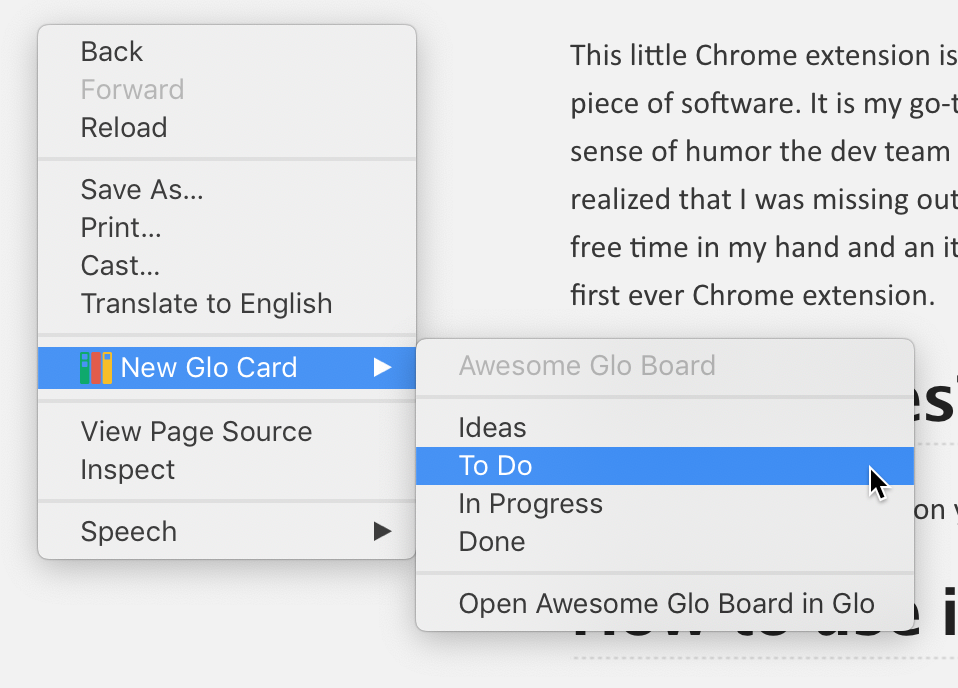

## Story so far
This little Chrome extension is created as an entry for the Glo API contest. Git Kraken is an amazing piece of software. It is my go-to GUI for git. I especially love the aesthetics of the software and the sense of humor the dev team displays.
When I first read about the Glo Boards API contest, I realized that I was missing out on this new feature that was hidden in plain sight.
Well I had some free time in my hand and an itch to create and learn. So here I am, writing about Chrome Glo, my first ever Chrome extension.

## What it does
Chrome Glo creates Cards on your Glo Board using the web page you are currently visiting.

## How to use it
The main feature of Chrome Glo is to create a new card on your Glo Board based on the webpage you are currently visiting. The instructions are very simple
1. Install the extension and login to your Glo Board account
2. Click the Chrome Glo icon on the toolbar and use the drop-down menu to choose the Board you want to work with.
2. When you are visiting a webpage right-click anywhere on the page and choose
New Glo Card -> "Your Column of Choice". You can right-click on a selected text or an image.
3. That's it, Chrome Glo will now create a new card for you and post it on your Glo Board.

Of course there is more to it and Chrome Glo will fill out your card based on your selection.
### If you made no selection
- Name of your card will be the title of the tab
- The description will include the URL of the page you are visiting
- A screenshot of the current tab will be attached to your card

### If you select some short text
- Name of your card will be your selection
- The description will include the URL of the page you are visiting
- A screenshot of the current tab will be attached to your card

### If you select longer text
- Name of your card will be the title of the tab
- The description will include the URL of the page and the selected text
- A screenshot of the current tab will be attached to your card

### If you select an image
- Name of your card will be the title of the tab
- The description will include the URL of the page
- The image selected will be attached to the card

## Edit cards automatically after creation
Chrome Glo offers an option to edit the generated cards right after they have been created. Open the board switcher by clicking on the Chrome Glo icon on the toolbar. You can check or uncheck "Show created cards in new tab" option. If this option is checked whenever you create a card, Chrome Glo will display it on the Glo Boards web-app.

## Design Principles
### 1. Keep it simple
This is a chrome extension for a dev tool which has an amazing web-app. Anything more than a couple clicks can be done through the web application. That is why Chrome Glo does very little but what it does it does effortlessly. That is also why I did not implement any card editing into the extension.
### 2. All about web content
Since this is a browser extension there is only one true use-case for this application. Quickly creating a Glo card based on the current web page. And that is exactly what Chrome Glo does.
### 3. Login once, switch seldom, create often
The user should ideally login once to the Glo Boards. A typical user would switching boards not so often, maybe once a day. But creating cards in different columns can happen quite often. Therefore all these interactions are layered. Login window will popup once during installation, board switching ability is somewhat tucked away neatly within the extension pop-up and the context menus will list all available columns, so that you can decide where to create your card on the go.

## How to Install
You can install Chrome Glo in two ways:
### Preffered Method - Using .crx file
1. Download the attached .crx file from the [latest release](https://github.com/LupenWonse/Chrome-Glo/releases/latest)
2. Open Chrome and navigate to [chrome://extension](chrome://extensions)
3. Enable "Developer Mode" by using the switch in the top header
3. Drag and drop the .crx file on the Extensions tab. Confirm the installation
4. You will be automatically redirected to Glo Boards for login

### Using unpackaged files
1. Download the souce code .zip file from the [latest release](https://github.com/LupenWonse/Chrome-Glo/releases/latest)
2. Unzip the files
2. Open Chrome and navigate to [chrome://extension](chrome://extensions)
3. Enable "Developer Mode" by using the switch in the top header
4. Click "Load Unpackaged" and browse to the directory where you unzipped the files
5. You will be automatically redirected to Glo Boards for login.
